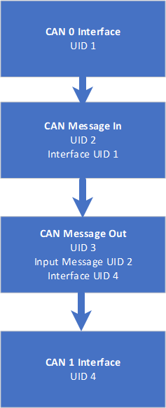

# XML Example: Transmitting ADC Data Over CAN Bus.

This example explains configuring a ReXgen data logger to transmit the ADC data over the CAN Bus.

#### Following ADC Data will be transmitted via CAN 0 Bus:

ADC 0

ADC 1

#### The below image shows how each element are linked in the XML file.

They are connected using Unique IDs (UID).

#### Default Settings:

CAN Baud Rate: 500 Kbps

ADC Sampling Rate: 100ms

CAN ID For various signals:

0x12A – ADC 0 & ADC 1

Example DBC provided with XML.

#### Following parameters can be modified by editing the XML as required.

Modifying CAN Bus Channel:

Edit the value of the PhysicalNumber element in the XML file under the CAN interface block.

0 for CAN 0, 1 for CAN 1, 2 for CAN 2 and 3 for CAN 3

\<CANINTERFACE UID="4">

&#x20;       \<Type>CAN\</Type>

&#x20;       \<PhysicalNumber>0\</PhysicalNumber>

&#x20;       \<CANBusSpeed>500000\</CANBusSpeed>

&#x20;       \<CANFDBusSpeed>8000000\</CANFDBusSpeed>

&#x20;       \<CANFDNonISO>false\</CANFDNonISO>

&#x20;

Modifying CAN Baud Rate:

Edit the value of the CANBusSpeed element in the XML file under the CAN interface block.

Value has to be specified in bps

\<CANINTERFACE UID="4">

&#x20;       \<Type>CAN\</Type>

&#x20;       \<PhysicalNumber>0\</PhysicalNumber>

&#x20;       \<CANBusSpeed>500000\</CANBusSpeed>

&#x20;       \<CANFDBusSpeed>8000000\</CANFDBusSpeed>

&#x20;       \<CANFDNonISO>false\</CANFDNonISO>

Modifying ADC Sampling Rate:

Edit the value of the SamplingRate element under the ADC List Block

Value has to be specified in milliseconds

\<ADC UID="6">

&#x20;       \<PhysicalNumber>0\</PhysicalNumber>

&#x20;       \<Rate>100\</Rate>

&#x20;       \<ParA>1\</ParA>

&#x20;       \<ParB>0\</ParB>

&#x20;     \</ADC>

Specifying the ADC Factor and Offset

Par A specifies the Factor, and Par B specifies the Offset.

\<ADC UID="6">

&#x20;       \<PhysicalNumber>0\</PhysicalNumber>

&#x20;       \<Rate>100\</Rate>

&#x20;       \<ParA>1\</ParA>

&#x20;       \<ParB>0\</ParB>

&#x20;     \</ADC>

Modifying the CAN Identifier for the messages:

Edit the values of MessageIdentStart and MessageIdentEnd Elements under the CANMESSAGE block for the message you wish to edit. Please note that the example DBC will be invalid after this change.

Value has to be entered in Decimal

\<CANMESSAGE\_LIST>

&#x20;     \<CANMESSAGE UID="36">

&#x20;       \<MessageIdentStart>299\</MessageIdentStart>

&#x20;       \<MessageIdentEnd>299\</MessageIdentEnd>

&#x20;       \<Direction>OutputPeriodic\</Direction>

&#x20;       \<DLC>8\</DLC>

&#x20;       \<IsExtended>false\</IsExtended>

Modifying the CAN Message transmission period:

Edit the values of Period Elements under the CANMESSAGE block for the message you wish to edit.

Value has to be entered in milliseconds

\<CANMESSAGE\_LIST>

&#x20;     \<CANMESSAGE UID="36">

&#x20;       \<MessageIdentStart>299\</MessageIdentStart>

&#x20;       \<MessageIdentEnd>299\</MessageIdentEnd>

&#x20;       \<Direction>OutputPeriodic\</Direction>

&#x20;       \<DLC>8\</DLC>

&#x20;       \<IsExtended>false\</IsExtended>

&#x20;       \<InterfaceUID>4\</InterfaceUID>

&#x20;       \<Period>100\</Period>
