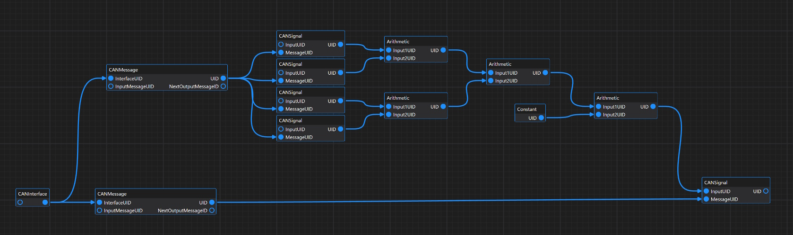
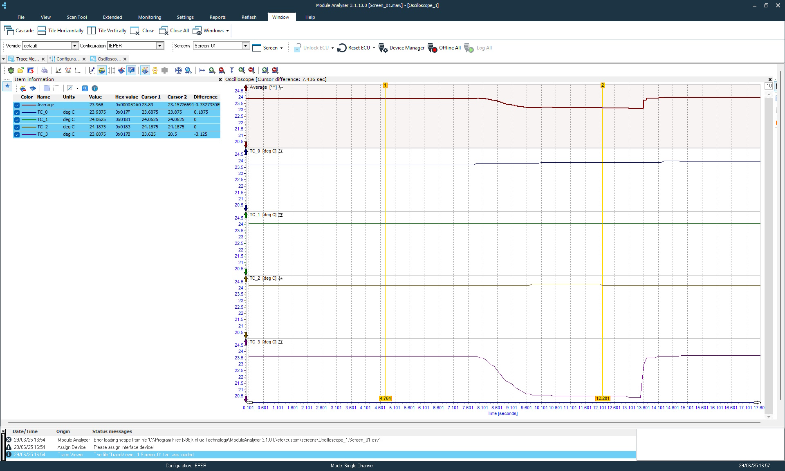
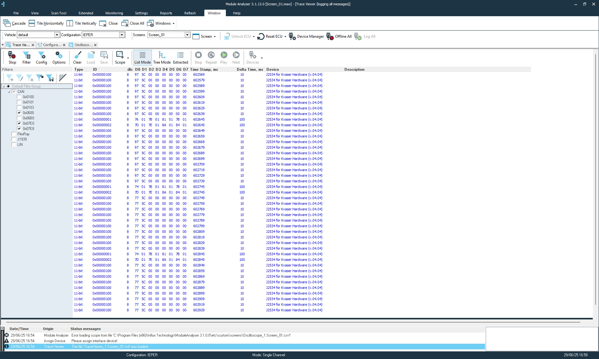

# Averaging four independant CAN signals to single CAN signal
This example show how easy can be used Rexgen to collect four CAN signals and convert it using Simulink block style transformation.

### Node structure

### Scope data with KTC four channels

### CAN trace with Module Analyser 

